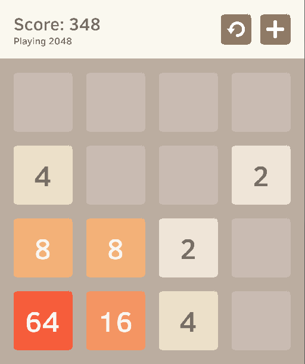

# Low level 2048 game implementation with SDL2

[](./demo.webm)

## Prerequisites

Build tools:
- gcc `≥ 9.3`
- make `≥ 4.3`
- cmake `≥ 3.17`

Libraries:
- sdl2 `≥ 2.0.12`
- sdl2_gfx `≥ 1.0.4`
- sdl2_ttf `≥ 2.0.15`

## Compilation

This project uses `cmake` for build proccess. To compile the source code, run following commands:
```shell
git submodule update --init --recursive
cmake CMakeLists.txt
make
```